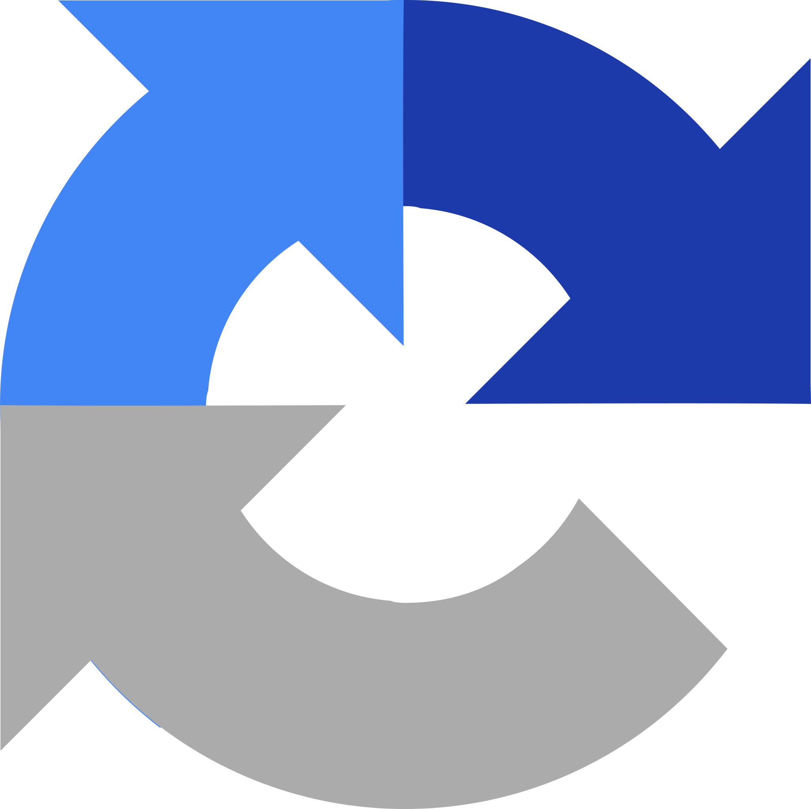
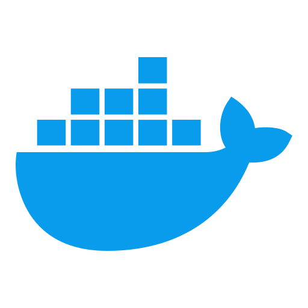
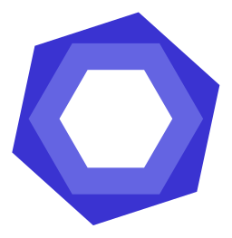

[## Hi there 👋](https://proglib.io/p/kak-kreativno-oformit-profil-na-github-chtoby-on-privlekal-vnimanie-2022-03-17

    
    

      
      
      
    

    
    <h1>
      hey there
      
    </h1>
  

  

    
  

### :man_technologist: About Me :

I am a Full Stack Developer  from India.
- :telescope: I’m working as a Software Engineer and contributing to frontend and backend for building web applications.

- :seedling: Exploring Technical Content Writing.

- :zap: In my free time, I solve problems on GeeksforGeeks and read tech articles.

- :mailbox:How to reach me: 
---

### :hammer_and_wrench: Languages and Tools :
## 🧱 Frontend

  
  
  
  
  
  
  
  
  
  
  
  
  
  
  
  
  
  
  

---

## 🔧 Backend

  
  
  
  
  
  
  
  
  
  
  
  
  

---

## 🗄️ Databases

  
  
  
  
  

---

## ⚙️ DevOps & Cloud

  
  
  
  

---

## 📡 Communication & Tools

  
  
  
  

---

## ✨ Code Quality & Auth

  
  
  
  

<!--
**Aist76/Aist76** is a ✨ _special_ ✨ repository because its `README.md` (this file) appears on your GitHub profile.

Here are some ideas to get you started:

- 🔭 I’m currently working on ...
- 🌱 I’m currently learning ...
- 👯 I’m looking to collaborate on ...
- 🤔 I’m looking for help with ...
- 💬 Ask me about ...
- 📫 How to reach me: ...
- 😄 Pronouns: ...
- ⚡ Fun fact: ...
-->
